# streaming-07-final-project
This project implements a streaming analytics solution using RabbitMQ for processing Car data. The goal of this project is handle and analyze used- car related information in real-time. We are using RabbitMQ as the message broker.

# Data Source

https://www.kaggle.com/datasets/mrsimple07/car-prices-prediction-data

# Prerequisite
 Ensure you have the following prerequisites:

Git
RabbitMQ server running
Python 3.10+ installed
VS studio Code
pika
csv
webbrowser
time
Required Python libraries (e.g., pika) installed in your active environmen

# How to Run
Follow these steps to run the project:

Clone the repository to your local machine:
Navigate to the project directory:
Start the producer to collect sending housing data:
Open separate terminal windows and start the producer and consumer for housing data:

# Process Overview

# Producer

This project includes a custom producer code  CarPricesPrediction_producer.py and  sending vehicle  data messages to RabbitMQ. 

# Consumer

The project includes CarPricesPrediction_consumer.py  to listen to and consume messages from RabbitMQ. It sets up multiple consumers, each responsible for processing messages from different queues:

QUEUE_NAME_1 = 'vehicle_data'  # Name of the first queue for all vehicle data

QUEUE_NAME_2 = 'expensive_vehicles'  # Name of the second queue for expensive vehicle

QUEUE_NAME_3 = 'excellent_condition_vehicles'  # Name of the third queue for vehicles in excellent condition

QUEUE_NAME_4 = 'High_mileage_vehicles'  # Name of the forth queue for vehicles with high mileage

# Screenshots

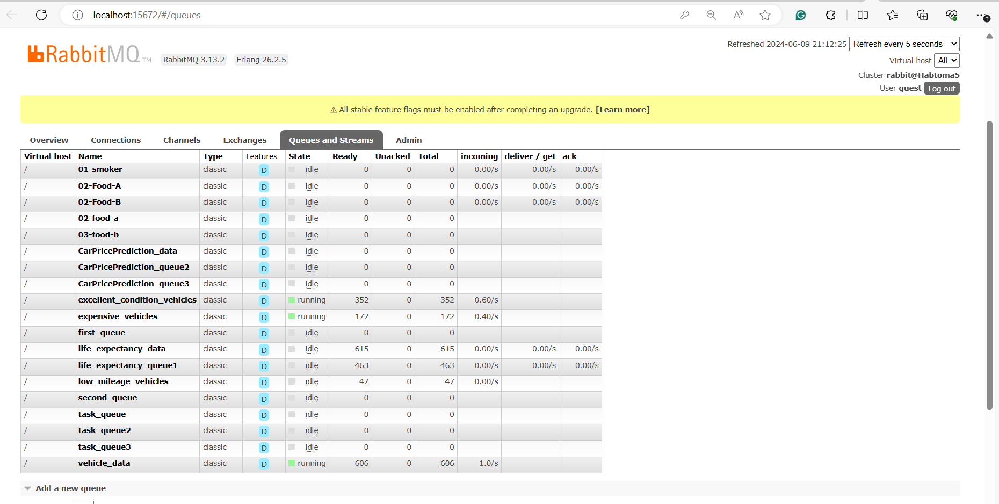
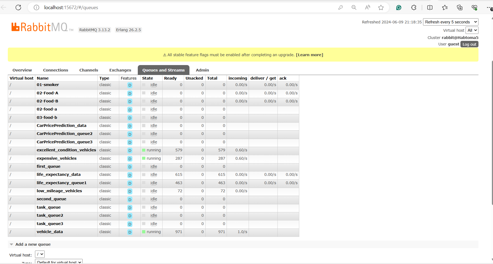
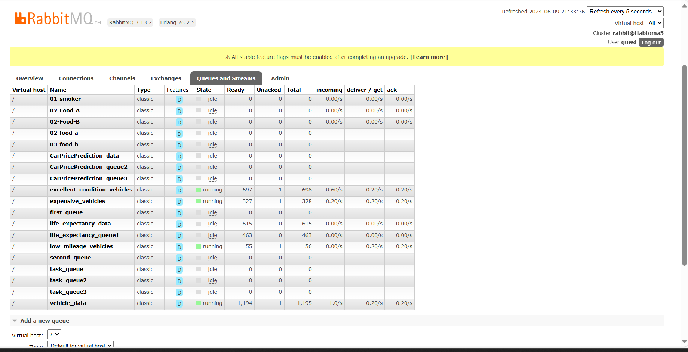
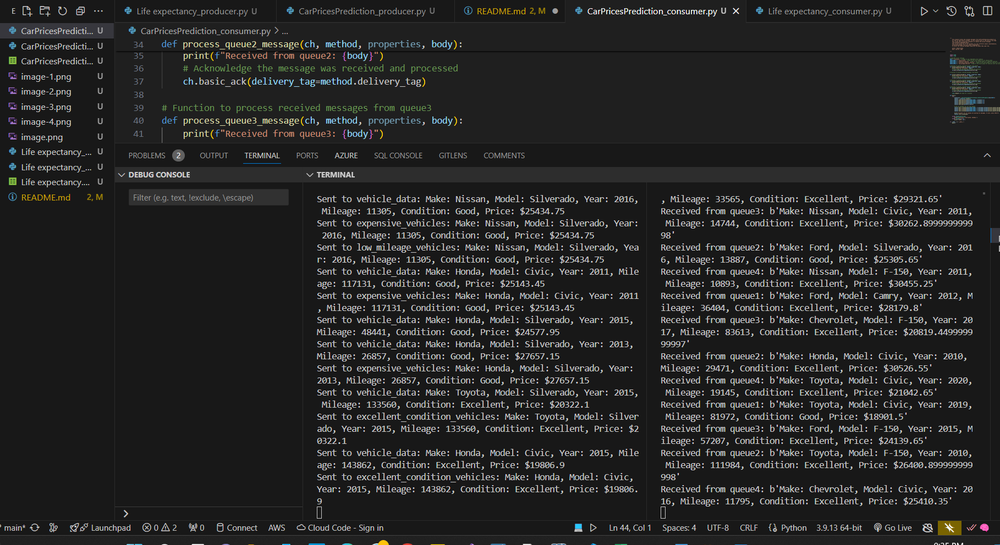
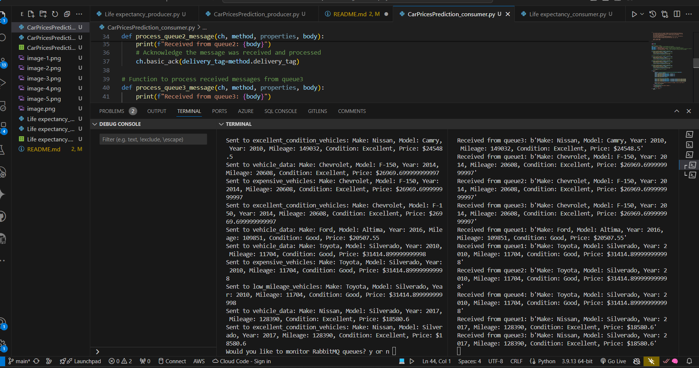
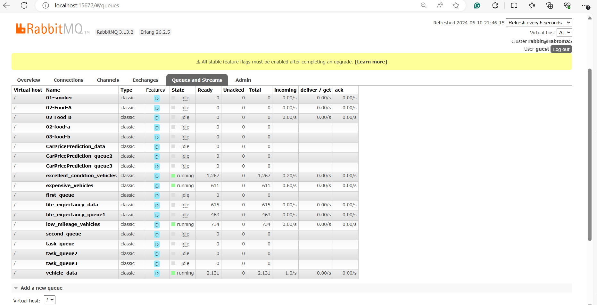
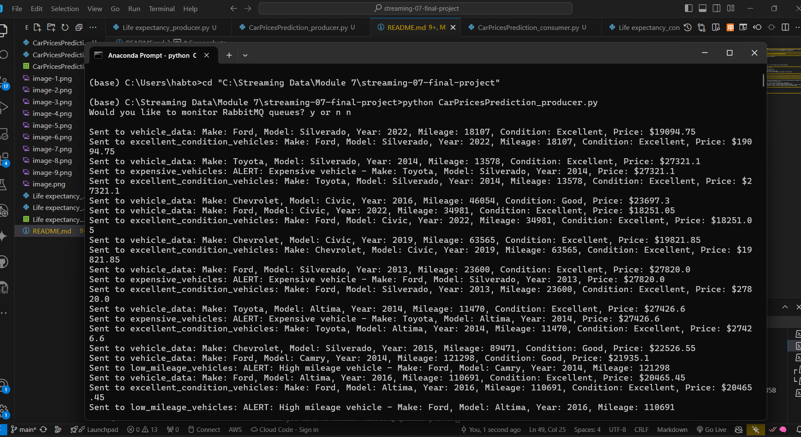
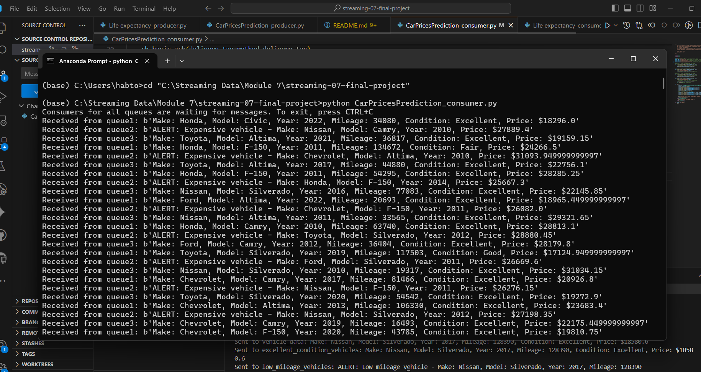
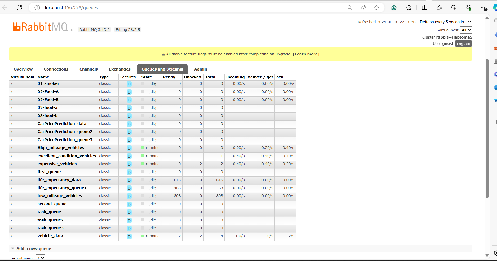
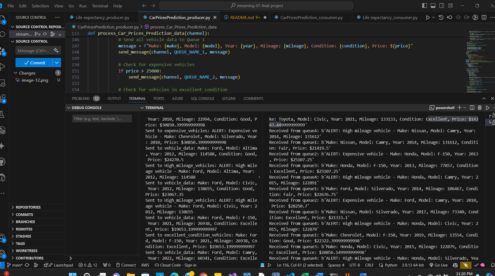
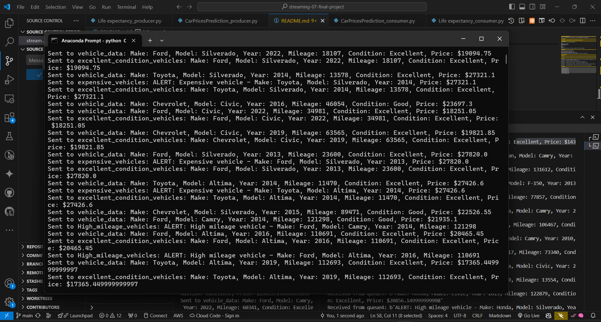
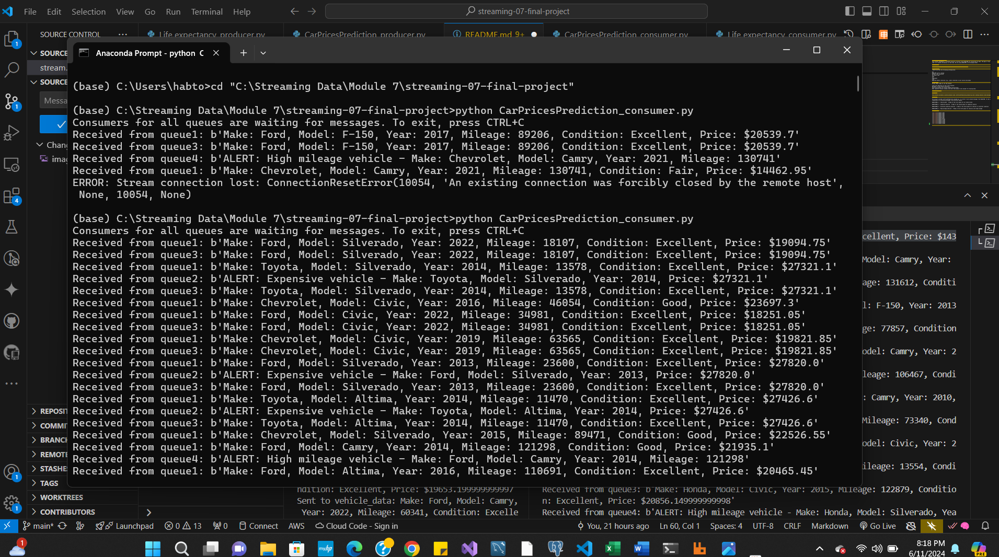
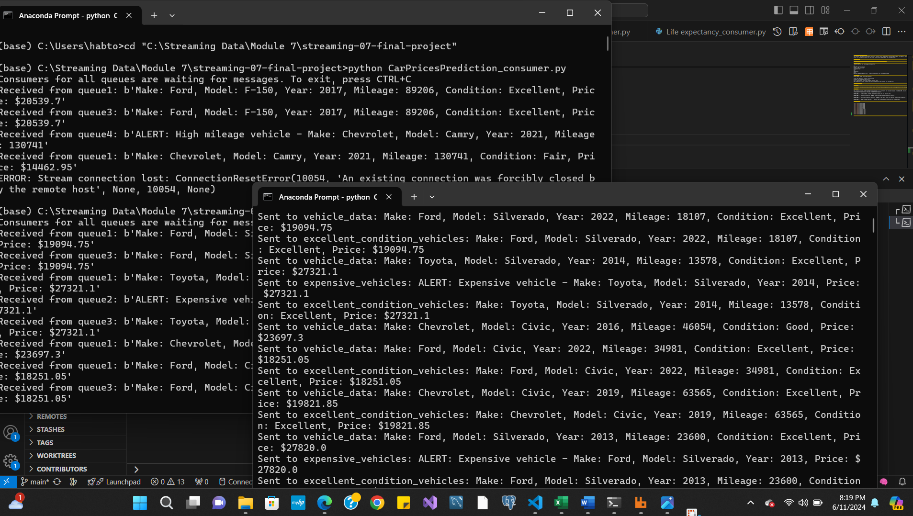

